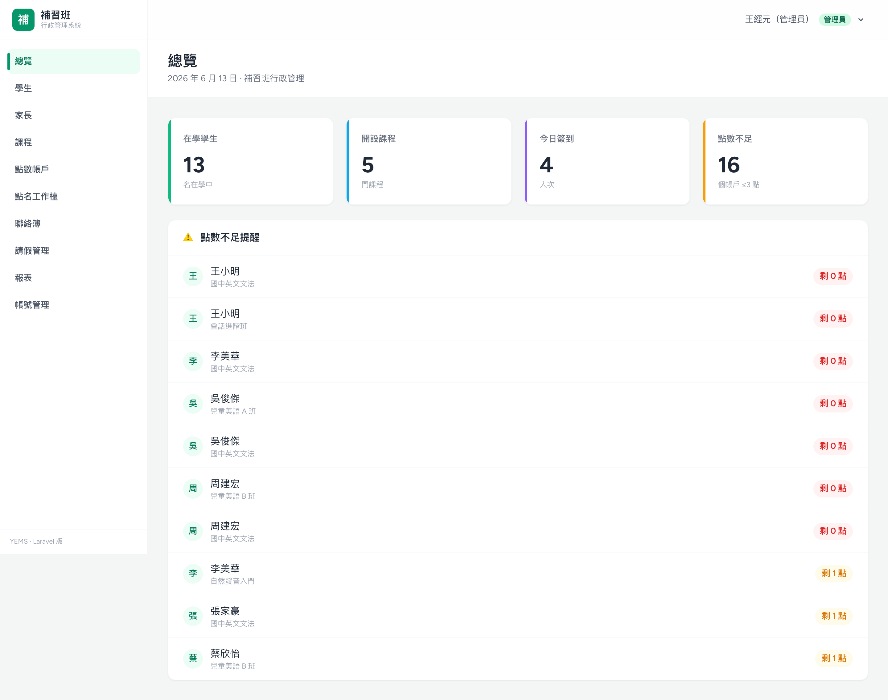
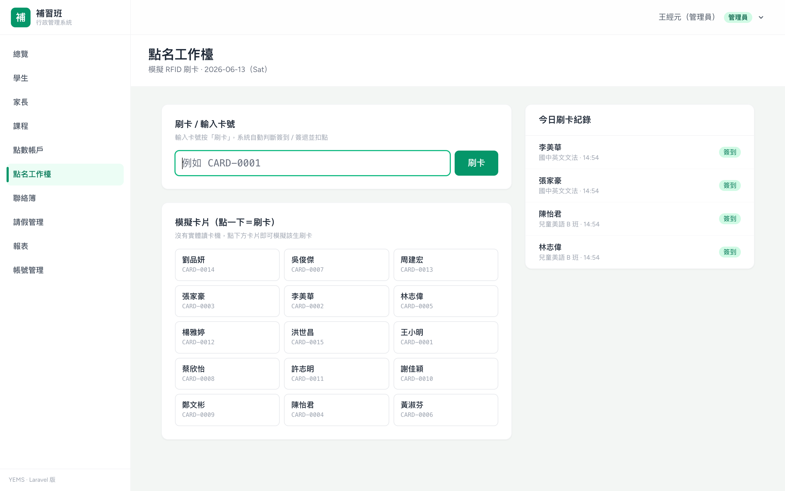
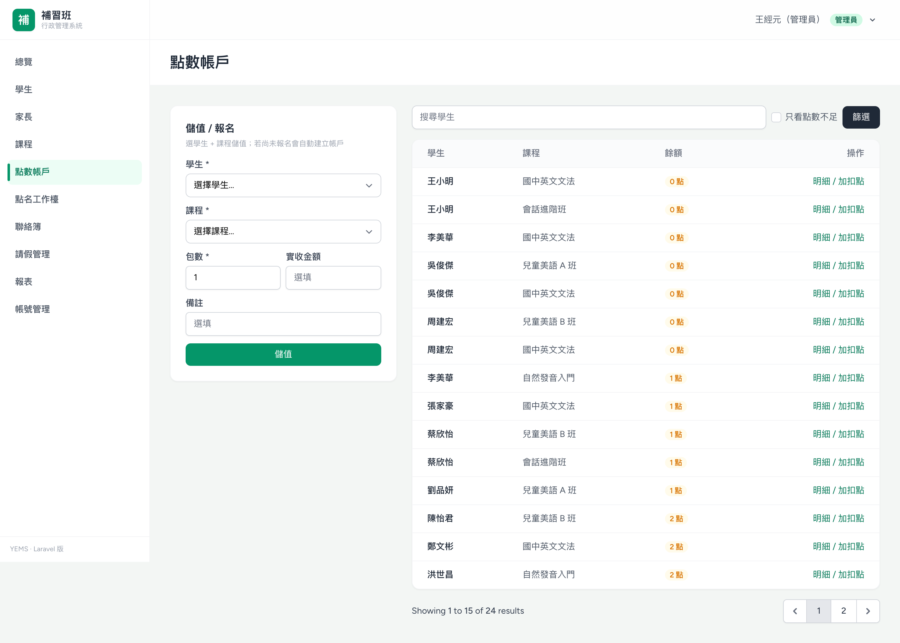
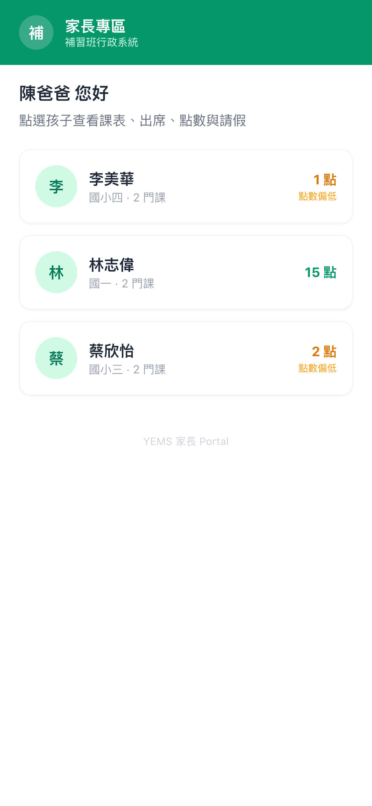

# 補習班行政管理系統（Laravel 版）

> Cram-school admin system — built with **Laravel 13 + Blade + Tailwind v4**
> 以 Laravel 完整重現我先前用 Next.js 開發的補習班系統（YEMS），作為全端跨語言能力的展示。

線上 Demo：_部署後補上_
作者：王經元 · JYTech-Studio

---

## 這個專案在展示什麼

我的主力是 **Next.js / Node.js**（另一個 YEMS 專案，真實補習班已上線使用）。
這個 repo 是我用 **AI-assisted development（Claude Code）從零學 Laravel**、在數天內完成的 PHP 版本，
**忠實復刻** YEMS 的資料模型與商業邏輯（13 張資料表、報名級點數、刷卡扣點、家長 Portal），
用來證明：**後端系統設計能力是跨語言的，換一個生態我也能快速交付可維護的產品。**

> 原版 YEMS 的點數扣抵、儲值、調整是寫在 PostgreSQL 的 plpgsql trigger / RPC；
> 這個 Laravel 版把同樣的邏輯搬到 application 層的 **Service 類別 + DB transaction + `lockForUpdate`**，
> 因此同一套程式碼在本地 **SQLite** 與線上 **PostgreSQL** 都能跑，並保有並發一致性。

## 畫面截圖

| 總覽 Dashboard | 刷卡點名工作檯 |
|:---:|:---:|
|  |  |
| **點數帳戶（儲值 / 扣點 / 餘額）** | **家長 Portal（手機版・無登入 token）** |
|  |  |

## 功能模組（9 個後台 + 家長 Portal）

| 模組 | 重點 |
|------|------|
| **總覽 Dashboard** | 在學人數 / 開課數 / 今日出席 / 點數不足提醒名單 |
| **帳號管理** | 建立後台 / 老師 / 家長 / 學生帳號，角色權限（僅管理員可進） |
| **學生管理** | CRUD、姓名 / 電話 / 家長搜尋、分頁、學生詳情頁 |
| **家長管理** | 家長 ⇄ 學生綁定、產生家長 Portal 存取連結（token） |
| **課程管理** | CRUD、每堂扣點、固定課表（星期 / 時段 / 教室） |
| **點數帳戶** | 儲值 / 扣點 / 手動調整；含原價・實收・折扣；異動全記錄，包在 DB transaction 內 |
| **刷卡點名工作檯** | 模擬 RFID 刷卡 → 自動判定進 / 退場、扣點、60 秒防重複刷；管理員可**作廢紀錄並退回扣點**（刪除 + 退點同一 transaction）|
| **聯絡簿 + 上課紀錄** | 每堂課紀錄 + 照片上傳（disk 由設定切換，部署改 Supabase S3）|
| **請假管理** | 後台登記 / 家長線上請假、補課狀態 |
| **報表** | 點數異動・請假紀錄匯出 **CSV（含 UTF-8 BOM）/ Excel（XLSX）**、財務統計 |
| **家長 Portal** | 無登入、靠 token 驗身分；mobile-first；查課表 / 出席 / 聯絡簿 / 線上請假 |

## 技術

| 項目 | 內容 |
|------|------|
| 框架 | Laravel 13（Blade 模板、Eloquent ORM、route-model binding） |
| 認證 | Laravel Breeze（Blade stack）；**不開放公開註冊**，帳號由後台建立 |
| 前端 | Tailwind CSS v4 + Vite + Alpine.js |
| 資料庫 | 本地 SQLite / 部署 PostgreSQL（Supabase）— migration 與 DB 無關 |
| 主鍵 | UUID（`HasUuids` trait，忠實復刻 YEMS、Supabase-ready） |
| 商業邏輯 | `CreditService` / `AttendanceService` — DB transaction + `lockForUpdate` 保證點數一致性 |
| 權限 | 自訂 `EnsureAdmin` middleware + 角色（admin / teacher / parent / student） |
| 檔案 | Laravel Storage，disk 由 `FILESYSTEM_DISK` 切換（本地 public / 線上 S3） |
| 匯出 | PhpSpreadsheet（XLSX）+ 自寫 CSV（UTF-8 BOM、Excel 中文不亂碼） |
| 測試 | PHPUnit Feature 測試 **56 項全綠**（頁面渲染、點數一致性、作廢退點、角色權限、Portal 存取控制） |

## 專案結構

```
app/
├── Http/
│   ├── Controllers/      # 後台 + Portal（Account / Student / Course / Credit / Attendance …）
│   └── Middleware/
│       └── EnsureAdmin.php        # 角色守門：僅 admin 可進管理頁
├── Models/               # 13 個 Eloquent 模型（皆用 UUID 主鍵）
│   ├── User.php                   # 統一帳號表，role = admin / teacher / parent / student
│   ├── Course.php / CourseSchedule.php
│   ├── Enrollment.php             # 報名（學生 × 課程，點數帳戶掛在這）
│   ├── CreditTransaction.php      # 點數異動全紀錄（儲值 / 扣點 / 調整）
│   ├── RfidCard.php / AttendanceRecord.php
│   ├── LeaveRecord.php
│   ├── LessonLog.php / LessonLogPhoto.php / StudentContactBook.php
│   ├── StudentParent.php          # 家長 ⇄ 學生多對多綁定
│   └── ParentAccessToken.php      # 家長 Portal 的無登入 token
└── Services/             # 商業邏輯抽離 Controller，包在 DB transaction 內
    ├── CreditService.php          # 扣點 / 儲值 / 調整，lockForUpdate 防併發超扣
    └── AttendanceService.php      # 刷卡進退場判定、自動扣點、防重複刷

database/migrations/      # 13 張業務資料表，與 SQLite / PostgreSQL 皆相容
resources/views/          # Blade 模板（後台 layout + 家長 Portal mobile-first）
routes/web.php            # 路由（含 /p/{token} Portal 無登入路由）
tests/Feature/            # PHPUnit Feature 測試 56 項
```

## 資料庫資料表（13 張）

| 資料表 | 用途 |
|--------|------|
| `users` | 統一帳號表，以 `role` 區分 admin / teacher / parent / student |
| `student_parents` | 家長 ⇄ 學生多對多綁定 |
| `courses` | 課程（每堂扣點、所屬類別） |
| `course_schedules` | 固定課表（星期 / 時段 / 教室） |
| `enrollments` | 報名（學生 × 課程），點數餘額掛在報名上 |
| `credit_transactions` | 點數異動全紀錄（儲值 / 扣點 / 手動調整，含原價・實收・折扣） |
| `rfid_cards` | 學生 RFID 卡片綁定 |
| `attendance_records` | 刷卡進退場出席紀錄 |
| `leave_records` | 請假與補課狀態 |
| `lesson_logs` | 上課紀錄（每堂課） |
| `lesson_log_photos` | 上課照片（disk 由設定切換，部署改 S3） |
| `student_contact_books` | 學生聯絡簿 |
| `parent_access_tokens` | 家長 Portal 無登入存取 token（可停用 / 設效期） |

## 本地啟動

```bash
composer install
npm install
cp .env.example .env
php artisan key:generate
php artisan migrate --seed     # 建表 + 灌入 demo 資料
php artisan storage:link       # 讓上傳照片可公開存取
npm run build                  # 或 npm run dev（開發熱更新）
php artisan serve              # http://localhost:8000
```

## Demo 帳號

| 角色 | 帳號 | 密碼 | 權限 |
|------|------|------|------|
| 管理員 | `admin@demo.com` | `Demo1234` | 完整（含刪除、帳號管理） |
| 老師 | `teacher@demo.com` | `Demo1234` | 日常作業，不可刪除 / 不可管帳號 |
| 家長 | `parent0@demo.com` ~ `parent2@demo.com` | `Demo1234` | （家長走 Portal，見下方）|

**家長 Portal** 走無登入 token 連結，不用帳密。從後台「家長管理」頁可產生 / 複製連結，
網址形如 `/p/{token}`。本地灌完 seed 後也可在「家長管理」頁直接點進去看。

## 測試

```bash
php artisan test                  # 全部 56 項
php artisan test --filter=Smoke   # 核心商業邏輯 28 項
```

涵蓋：未登入導向、各頁渲染、點數扣點與餘額一致性、扣點不可超額（會 rollback）、
角色權限（老師刪除回 403、管理員可刪）、CSV BOM / XLSX 匯出、家長 Portal 只能看自己孩子、線上請假。

## 部署

- 資料庫：Supabase（PostgreSQL）；`.env` 把 `DB_CONNECTION` 改 `pgsql`、填 Supabase 連線字串即可，migration 無須改。
- 檔案：`FILESYSTEM_DISK` 改成 Supabase S3 相容 disk。
- 平台：Zeabur / Railway（PHP buildpack）。

---

© 王經元 · JYTech-Studio — 作品集用途
